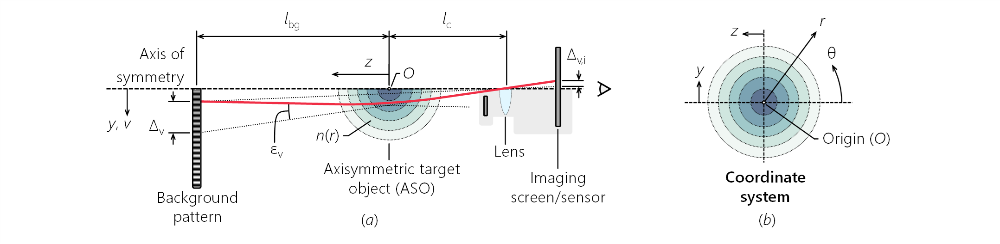

# AUBOS

(***A***xisymmetric ***U***nified ***B***ackground-***O***riented ***S***chlieren and related operations)

[](https://lbesson.mit-license.org/)

This program is designed to analyze background-oriented schlieren data for axisymmetric objects and to evaluate the related transforms and kernels. Inverse analysis focuses on interpreting data within the unified framework ([Grauer and Steinberg, 2020][GrauerSteinberg20]), thus implementing axisymmetric unified background-oriented schlieren (AUBOS), and with the use of Bayesian inference and priors. 

The coordinate system used here for the overall axisymmetric schlieren problem is shown below. 



The positive *z*-direction is chosen to proceed forward, away from the camera, and perpendicular to the imaging plane. The origin is placed at the middle of the axisymmetric target object (ASO), such that *z* = 0 represents the distance from the camera lens to the center of the ASO along the imaging axis. Accordingly, cameras are typically places at *z* < 0. 

## Setup

This program has a single dependency that are included as submodules: the **cmap** package available at https://github.com/tsipkens/cmap. As a result, this folder will initially be empty. The submodules can be downloaded manually from the above sources and placed in the `cmap/` folder. If cloning using git, clone the repository using 

```shell
git clone git://github.com/tsipkens/aubos --recurse-submodules
```

which will automatically download the submodule. To be used directly, these packages should then be added to the MATLAB path at the beginning of any script using

```Matlab
addpath cmap;
```

Instead of the **cmap** package, one could also replace references in existing scripts to the colormaps that would otherwise be in that package. This would have to include removing any reference to the `cmap_sweep` function (which allows for line plots to sweep through a colormap) that appears in some of the main scripts.   

## Components

#### Packages

Much of this codebase is distributed amongst a series of packages (folders that start with **+**). These functions can be accessed by appending the package name and a `.` before the function name. For example, the `textbar(...)` function in the **tools** package can be called using `tools.textbar(..._)`. Available packages include:

1. The **+transforms** package contain functions explicitly evaluating the Abel and new transform described by Sipkens et al. (XXXX). There methods form the mathematical basis for the kernels derived subsequently but are not used directly during inversion. 

2. The **+kernel** package includes functions to generate operators for solving the axisymmetric problem, including forward/inverse, indirect/direct, and Abel/ARAP-type operators. 

3. The **+tools** package contains miscellaneous functions to aid in analysis, e.g., text-based toolbar function. Of note, `tools.run(...)` is a wrapper for the conventional (i.e., not unified) operators that packages together the necessary steps to be used by any given method to convert a pair of reference and deflected images into a refractive index field. For example, this includes the deflection sensing and integration steps, as necessary. 

4. The **+regularization** package contains tools that add prior information or stabilize inverse operators (including the onion peeling and ARAP operators), such as computing prior covariance matrices (e.g., for Tikhonov regularization). 

#### Classes

This codebase also contains three classes (folders that start with **@**): 

1. The **Aso** class is used to handle axisymmetric objects that are only defined with respect to radial position (i.e., do not have axial variations). The functions in the **+kernel** package are built to evaluate the transforms for these objects. 

2. The **Aso2** class, similarly, is used to handle axisymmetric objects, this time by including radial and axial variations. Solving these problems generally takes much longer than the 1D case considered above. 

3. Finally, the **Camera** class is used to output the ray positions and directions for a pinhole camera, which established a framework by which to expand this representation to include other effects (e.g., lens aberration). 

We refer the reader to individual functions and class definitions for use and more information. 

#### Main scripts

Finally, example and high-level scripts generally follow the naming convention `main*`. Generally, `main_*` scripts examine the 1D (radial only) problem, while `main2_*` scripts consider the 2D (radial and axial) problem. 

## Tutorials

This codebase can be used for three purposes: (A) visualizing the transforms that underlie the problem; (B) evaluating the forward model, that is computing the deflections from a scaled refractive index field; and (C) evaluating the inverse model, that is going from a deflection field or pair of images to a refractive index field. 

### A. Visualizing the ARAP transforms

While projecting axisymmetric objects is typically achieved using the Abel transform, which has a kernel of 


Sipkens et al. (XXXX) derived the arbitrary ray, axisymmetric projection (ARAP) transform, not requiring that the rays passing through the ASO be parallel. This has a kernel of

^{\frac{3}{2}}}\frac{2y_0}{\sqrt{r^2-y_0^2(1+m_{y}^2)^{-1}}}}.)

This code includes tools to visualize and compare these transforms directly, relying on the functions in the **transforms** package. For example, the direct, Abel transform can be evaluated using

```Matlab
K = transform.abeld(y0, r_vec);
```

while the direct ARAP transform can be evaluated using 

```Matlab
K = transform.arapd(my, y0, r_vec);
```

A comparison of these transforms is demonstrated in the `main_transform` script in the upper directory. 

A demonstration of the transforms is also available as a web app at https://tsipkens.github.io/aubos. 

### B. Forward problem: Computing deflection fields

Differences between the deflection fields projected using the traditional Abel and ARAP kernels and the use of the **Aso** class is demonstrated for the 1D problem (radial only) in the `main_aso` script. This script starts by defining creating an instance of the **Aso** class with an outer radius of *R* = 1 and *N*<sub>r</sub> = 125 annuli or elements, 

```Matlab
R = 1;  % outer radius
Nr = 125;  % number of elements
aso = Aso(Nr, R);  % Aso object
```

Then, we build a phantom refractive index field. For example, 

```Matlab
bet = normpdf(aso.re, 0, 0.3);  % Gaussian refractive index field
```

creates a Gaussian refractive index field, centered about *y* = 0 and with a standard deviation of 0.3. The phantom is evaluated at the edges of ASO's annuli, that is `aso.re`.  Other phantoms are available in that work, to show several cases. 

Next, we must define the ray trajectories. There are multiple ways to do this, including the built-in [**Camera**](#1-representing-cameras-and-ray-trajectories) class. For the sake of this example, we want to focus only on the rays that would pass close to the ASO. As such, we preferentially pick where the rays cross *z* = 0, i.e., *y*<sub>0</sub>, using

```Matlab
Nv = 400;  % 400 rays (or "camera pixels")
cam.y0 = 5 .* linspace(-aso.re(end), aso.re(end), Nv);  % rays cross z = 0
```

This creates a vector of length 400 of *y*<sub>0</sub> positions spanning from -5*R* to 5*R*, which is the bounds of the plot generated later. We store this information in a `cam` structure (which emulates the [**Camera**](#1-representing-cameras-and-ray-trajectories) class). The other piece of information we need, is the camera origin. We choose the camera position to be close to and above the ASO, which will result in asymmetries in the deflection field, 

``` Matlab
oc = [0, 1.5, -1.5];
```

Note that for the 1D case, the first entry of `oc` is ambiguously assigned 0. We can now calculate the final required piece of information, namely the slope of the ray by solving a simple linear equation based on knowing two points along the straight ray path, 

```Matlab
% Slope implied by camera location. 
cam.my = (oc(2) - cam.y0) ./ oc(3);
```

Now we are ready to compute the ARAP kernel, 

```Matlab
Kl = kernel.linear_d(aso, cam.y0, cam.my);  % compute linear ARAP kernel
```

The deflection field can be computed by multipling this kernel by the phantom, `bet`, computed above. Specifically, 

```Matlab
bl = Kl * bet;  % using linear kernel
```

Finally, plot the result, noting that the asymmetry in the deflection field is visible, 

```Matlab
figure(6); plot(cam.y0, bl);  % plot of deflection magnitude
```

The associated `main_aso` script adds a loop over multiple camera positions to show trends in the deflection field. 

Forward projections are also available as a web app at https://tsipkens.github.io/aubos. 

### C. Inverse problem: Computing refractive index fields

This is demonstrated in `main_compare*`, which compares multiple inversion techniques, generating figures similar to those seen in Sipkens et al. (XXXX). 

## Description

What follows is a description of some of the key concepts required to use this codebase. 

### 1. Representing cameras and ray trajectories

Imaging inherently requires the use of cameras or ray trajectories. Multiple options exist for defining a camera or equivalent within this codebase. In any case, one must define the trajectories for rays leaving the camera, which will then be used with other components of this codebase. Each ray should be represented by a series of four parameters: 

`y0` - This is the *y*-position (i.e., radial position in the imaging plane) at which the ray crossed *z* = 0, that is the center of the ASO in a plane parallel to the imaging plane. This quantity is present in the Abel transform. 

`x0` - The *x*-position (i.e., the axial position in the imaging plane) at which the ray crosses *z* = 0.

`my` - The slope of the ray in the *y*-*z* plane. This determines how quickly the ray traverses the radial direction. The `my = 0` case corresponds to the Abel scenario.

`mx` - The slope of the ray in the *x*-*z* plane, that is how quickly the ray traverses the axial direction. 

These properties are assigned to a structure, `cam`, which is passed between methods. We provide two examples of how one can define these properties. 

#### 1.1 Manual calculation

The first involves manually setting the camera properties.  Within the examples provided with this codebase, this is used extensively whenever one wants to focus on the deflection field for only rays in the proximity of the ASO (in other words, ignoring the larger field of view that may be relevant to a real camera). In this case, one can set a camera position and, assuming a pinhole camera, find the trajectory of rays that would originate from the pinhole camera and transect the *z* = 0 plane at certain positions. To start, let's define a camera origin, with the camera being 20 a.u. away from the center of the ASO. 

```Matlab
cam.x = 2;  cam.y = 0;  cam.z = -20;
```

Next, use Matlab's `meshgrid(...)` method to lay out a grid of points for where the rays cross *z* = 0, that is *y*<sub>0</sub> and *x*<sub>0</sub>, which forms the basis for an image. 

```Matlab
% Select only rays that would pass close to ASO.
y0_vec = linspace(-2, 2, Nv);  % 2 a.u. above and below center
x0_vec = linspace(0, 4, Nu);  % 0 -> 4 a.u. axially
[cam.x0, cam.y0] = meshgrid(x0_vec, y0_vec);
cam.y0 = cam.y0(:)';  % vectorize and convert to row vectors
cam.x0 = cam.x0(:)'; 
```

The slopes of the rays can now be calculated from these positions by solving a linear equation representing the ray trajectory. 

```Matlab
% Slope of rays based on origin and z = 0 crossings.
% Based on solving for the slope in a simple linear equation.
cam.my = (cam.y - cam.y0) ./ cam.z;
cam.mx = (cam.x - cam.x0) ./ cam.z;
```

#### 1.2 Camera class

While the above treatment is useful within the context of visualizing theoretical deflection fields, as was relevant in generating figures for the associated work by Sipkens et al. (XXXX), more often cameras will instead be specified with a camera origin and focal length. This is the function of the `Camera` class. The class has properties that mirror those of the manual approach, including the `y0`, `my`, `x0`, and `mx` properties necessary to evaluate ARAP kernels and, as such, can be used interchangeably. 

--------

### Acknowledgements

This code contains several excerpts from a previous, private codebase by Samuel Grauer (@sgrauer) that were modified for use with this program. 

### References

[Grauer, S. J., & Steinberg, A. M. (2020). Fast and robust volumetric refractive index measurement by unified background-oriented schlieren tomography. Experiments in Fluids, 61(3), 1-17.][GrauerSteinberg20]

[GrauerSteinberg20]: https://link.springer.com/article/10.1007/s00348-020-2912-1
